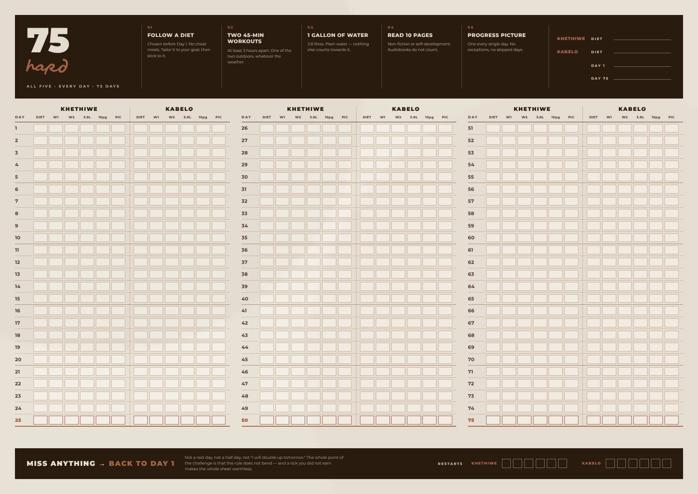

# 75 HARD — two-person tracker

One **A3 landscape** sheet (420 × 297 mm). 75 days, two people, 900 tick boxes.



---

## What's here

| File | What it is |
|---|---|
| `print/75-hard-A3-landscape.pdf` | The sheet, print-ready — 1 page, A3 landscape |
| `tracker.html` | The same sheet on screen |
| `print.html` | The print stylesheet version, if you'd rather print from a browser |
| `preview/tracker-A3.png` | The image above |
| `build.py` | Regenerates both HTML files |
| `render.mjs` | Re-renders the preview and the PDF, and checks the sheet doesn't overflow |
| `fonts/` | Mairo and Montserrat, embedded into the output as base64 |

## Printing

Print at **100% / "Actual size"**, A3, **landscape**, background graphics **on**.
Fit-to-page shrinks the boxes below the size of a pen tick.

160 gsm matte survives 75 days on a wall and takes ballpoint without bleeding
through. If you only have A4, printing at 71% still works but the boxes drop to
about 6 × 3.7 mm — tight. A3 is worth the trip to a print shop.

---

## How it's laid out

Three blocks of 25 days, left to right: **1–25**, **26–50**, **51–75**.

Both people sit on the **same day row**, separated by a vertical rule —
**Khethiwe** on the left, **Kabelo** on the right. That's the point of the thing:
a glance down the sheet shows who is behind, and on what, without comparing two
separate charts.

The names are set in `build.py` → `PEOPLE`; change them there and rebuild.

Six tick boxes per person per day:

| Box | Rule |
|---|---|
| `DIET` | Diet held, no cheat meals |
| `W1` | First 45-minute workout |
| `W2` | Second 45-minute workout — 3+ hours later, one of the two outdoors |
| `3.8L` | One gallon of plain water |
| `10pg` | Ten pages read |
| `PIC` | Progress picture taken |

Rule 2 is two workouts, so it gets two boxes — five rules, six boxes.

Every fifth day carries a heavier rule so you can count down the sheet at a
glance. **Days 25, 50 and 75** are marked in terracotta.

The header carries both names, a blank for each **chosen diet** (rule 1 says pick
it before Day 1 — writing it on the sheet is what stops it being renegotiated in
week three), and the Day 1 / Day 75 dates.

The footer carries the restart tally. Six boxes each. Hopefully wasted ink.

---

## A note on the design

Ticking is deliberately cheap and visible: an unbroken run of filled boxes is
the whole motivational mechanism, and a single gap is meant to be obvious from
across the room. That's also why the restart tally is printed rather than left
off — the challenge only means anything if the restart is honoured, and a
tracker that makes restarting invisible quietly invites fudging.

Palette and type match the vision board in `../vision-board`, so the two hang
together on the same wall.

---

## Editing

```bash
python3 build.py                        # rewrites tracker.html and print.html
npm i playwright && node render.mjs     # refreshes preview/ and print/
```

The sheet is fixed at exactly A3 and clips anything that doesn't fit, so
`render.mjs` checks for overflow and prints the box count. If you change the row
height, the block count or the task list at the top of `build.py`, run it and
check it still says *fits*.
