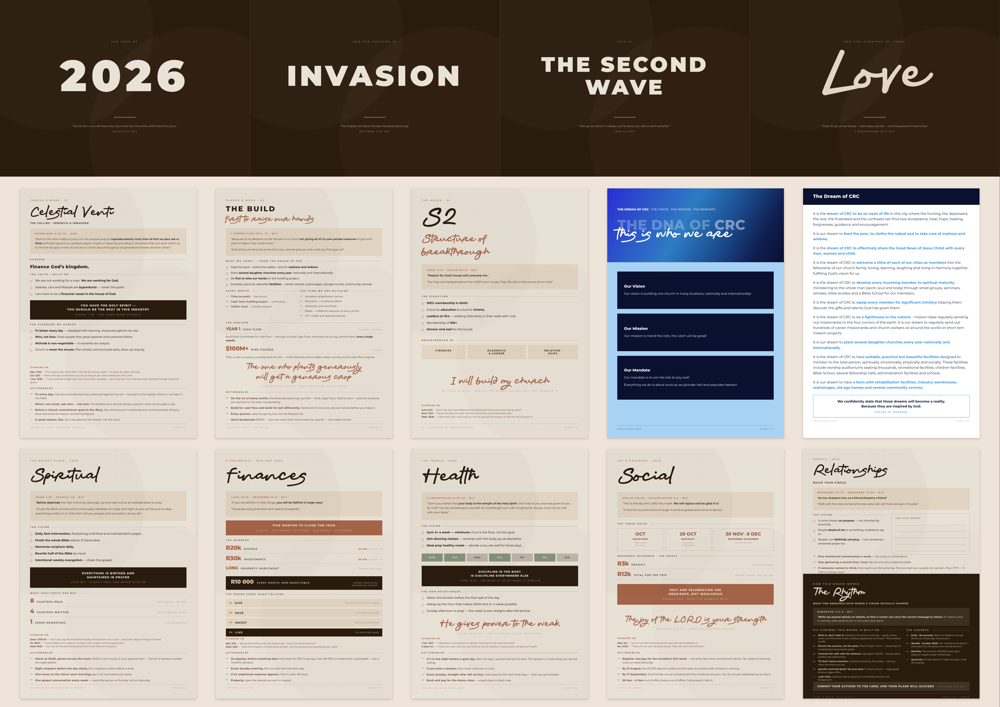

# 2026 — INVASION — THE SECOND WAVE — LOVE

A printable vision board: **14 A4 sheets** that paste onto an **A0 landscape canvas
(1189 × 841 mm)**.



---

## What's here

| File | What it is |
|---|---|
| `board.html` | The full A0 landscape preview — how the finished canvas will look |
| `print/01-headline-A4-landscape.pdf` | 4 pages, **A4 landscape** — the headline strip |
| `print/02-cards-A4-portrait.pdf` | 10 pages, **A4 portrait** — the vision cards |
| `print-banner.html` / `print-cards.html` | The same sheets as HTML, if you'd rather print from a browser |
| `preview/board-A0.png` | The preview image above |
| `preview/sheets/*.png` | Every sheet on its own, for checking one card up close |
| `build.py` | Regenerates everything after an edit |
| `render.mjs` | Re-renders the preview and PDFs, and audits every sheet for overflow |
| `fonts/` | Mairo and Montserrat, embedded into the output as base64 |

---

## Printing

Print **both PDFs at 100% / "Actual size"** — *not* "Fit to page", which silently
shrinks everything and breaks the tiling.

- `01-headline-A4-landscape.pdf` → A4, **landscape**, 4 pages
- `02-cards-A4-portrait.pdf` → A4, **portrait**, 10 pages

Turn **on** background graphics/colours. Six sheets carry heavy ink — the four
headline tiles, the CRC DNA sheet, and the lower half of C10 — so if your printer
leaves a white border, trim it; if it can print borderless, use that. Matte
120–160 gsm holds the deep espresso and the CRC navy without buckling.

---

## The layout

```
┌──────────┬──────────┬───────────┬─────────┐
│   2026   │ INVASION │THE SECOND │  Love   │  ← 4 × A4 landscape, edge to edge
│    B1    │    B2    │  WAVE  B3 │   B4    │     (297 × 210 each = 1188 mm)
├──────┬───┴────┬─────┴────┬──────┴──┬──────┤
│  C1  │   C2   │    C3    │   C4    │  C5  │  ← 10 × A4 portrait, 5 across × 2 down
│Celes-│  The   │    S2    │ DNA of  │Dream │
│tial  │ Build  │Structure │  CRC    │of CRC│
│Venti │        │          │         │      │
├──────┼────────┼──────────┼─────────┼──────┤
│  C6  │   C7   │    C8    │   C9    │ C10  │
│Spiri-│Finances│  Health  │ Social  │Rela- │
│tual  │        │          │         │tion- │
│      │        │          │         │ships │
│      │        │          │         │──────│
│      │        │          │         │ The  │
│      │        │          │         │Rhythm│
└──────┴────────┴──────────┴─────────┴──────┘
```

Each sheet is a **whole, self-contained card** — no headline word and no sentence is
ever split across a seam. Small misalignments when you paste simply do not show.

**Sheet C10 carries two panels** on the one A4 page: *Relationships* on top (linen) and
*The Rhythm* below (dark), divided by a hairline. Cut along it or leave it — either
way it pastes as one piece, and the dark lower half anchors the bottom-right corner
against the dark banner at the top.

### Pasting it up

1. Lay the canvas landscape. Mark a light pencil line **210 mm down from the top** —
   that's the bottom of the headline strip.
2. Paste the four headline tiles first, left to right, butted edge to edge along the
   top. They span the full width.
3. Leave roughly **14 mm** below the strip, then set out row 1 (C1–C5) with about
   **24 mm** margins left and right and **22 mm** between cards. Dry-lay the whole row
   before any glue touches paper.
4. Leave about **13 mm**, then row 2 (C6–C10) on the same column lines.
5. Spray mount or a glue stick around the edges and the centre. Work from the middle
   of each sheet outward to push air out.

The gaps are part of the design — the canvas colour showing between cards is what
makes it read as a gallery wall rather than a poster.

---

## The design

**Two fonts, both CRC's own:**

- **Mairo** — CRC's brand hand. Every script title, every pull-quote, "Love" on the
  headline, and "this is who we are" on the DNA sheet.
- **Montserrat** — CRC's brand sans. Everything structural.

**Colour** — from the reference swatches: Linen White `#E8E1D5`, Creme `#EEE4DA`,
Sand `#E1D4C2`, Toasted Almond `#CEB59E`, Stone `#A78D78`, Terracotta `#A46447`,
Deep Umber `#4C362D`, Espresso `#291C0E`, Muted Sage `#88937B`.

**Sheets C4 and C5 deliberately break that palette** and use CRC's own — navy
`#0A1130`, blue `#5CB2ED` / `#3E97DE`, sky `#A8D2F4` — reproducing the DNA banner
gradient, the three navy vision/mission/mandate cards on light blue, and the dream
itself as white page with navy header bar and blue emphasis, exactly as the site
sets it.

---

## Scripture

**NLT throughout**, except **Ephesians 3:20–21, which is AMP** on sheet C1.
Every reference is labelled with its translation on the card.

---

## Why the board is built this way

The structure isn't decorative. Every card carries **scripture → vision →
actionables**, in that order, because that sequence is what the research on goal
achievement keeps pointing at:

- **Written goals plus action commitments plus weekly reporting.** Gail Matthews
  (Dominican University of California) found roughly **76%** of participants who
  wrote their goals, wrote action commitments and sent weekly progress to a friend
  achieved them, against **43%** who only thought about theirs.
- **Rehearse the process, not the outcome.** Pham & Taylor (UCLA, 1999) found
  students who mentally rehearsed *studying* outperformed those who pictured the
  good grade — outcome-only fantasy actually reduced effort.
- **Contrast the wish with the obstacle.** Oettingen's mental contrasting (WOOP)
  shows positive fantasy alone predicts *lower* achievement.
- **If–then beats intention.** Gollwitzer & Sheeran's meta-analysis across 94 studies
  found implementation intentions — naming *when and where* — produce one of the
  larger effects in the literature. Hence "If it is Monday 06:00, then…".
- **Specific and hard beats "do your best."** Locke & Latham. Hence R4 000/month,
  8 chapters a day, 4× a week, 100+ members, $100M — numbers, not adjectives.
- **Daily visual exposure.** Hence: A0, on a wall, where you pass it.

The cadence lives on the lower half of C10: **daily 60 seconds · weekly Sunday 18:00
review sent to one person · monthly numbers · quarterly reset.** The board only works
if that happens.

**S2 has no actionables** by request — it is a statement of structure, not a task list.

---

## The numbers, and where they came from

**Finances (C7)** — five months to close the year: August, September, October,
November, December.

| Goal | Total | Per month |
|---|---|---|
| Savings | R20 000 | **R4 000** |
| Investments | R30 000 | **R6 000** |
| | | **R10 000/month** |

Plus **R3 000/month** for the December trip (see C9), so the real monthly commitment
is R13 000 in September, October and November.

**Social (C9)**

- **October marathon** — week 1 starts this week; roughly ten weeks to race day,
  long run every Saturday.
- **Birthday, 29 October** — venue booked and invitations out by **17 September**
  (six weeks ahead).
- **Remember December, 30 Nov – 9 Dec 2026** — **R12 000** total. **R3 000 deposit
  due by 31 August**, then R3 000/month across September, October and November.

**Spiritual (C6)** — from today to 31 December is about 157 days.

| Goal | What it costs per day |
|---|---|
| Finish the whole Bible | **8 chapters** (1 189 ÷ 157) |
| Rewrite half the Bible | **4 chapters written** |
| Memorise scripture daily | **1 verse** — about 157 by year end |
| Weekly evangelism | 1 named gospel conversation, ~22 by year end |

---

## Editing

All content and styling lives in `build.py`. Change the copy, then:

```bash
python3 build.py                        # rewrites the three HTML files
npm i playwright && node render.mjs     # refreshes preview/ and print/
```

`render.mjs` also **audits every sheet for overflow**, which matters: cards are fixed
at exactly A4 and silently clip anything that doesn't fit. It prints a fill ratio per
sheet so you can see which cards have dead space.

One typographic gotcha: **Mairo's descenders drop well below the line box.** Any
script title needs a real bottom margin (3 mm+), never 1 mm, or the tail of a *y* or
*g* will run into the line beneath it.

---

## The career sheets

C1 and C2 are written from the **Vision Meeting of 27 July 2026** (Sethu Zwane,
Calvin Beck, Khethiwe Kobe) rather than from general ambition:

- **Celestial Venti** is the holding company; **Serentia** and **Innadern** are the
  portfolio brands and the cash-flow engines.
- **Purpose:** finance God's kingdom. Salaries, cars and lifestyle are byproducts.
  We are not working for a man — we are working for God.
- **Responsibilities adopted from the dream of CRC:** feed the poor, clothe the naked,
  care for orphans and widows; plant several daughter churches every year, nationally
  and internationally; be first to raise our hands on the building project; develop
  suitable, practical, beautiful facilities — rehab centres, orphanages, old-age homes,
  community centres.
- **Every month:** tithe on profit to the church; continuous giving to the Cape Town
  building project; monthly support to Talitha Cumi — reported transparently.
- **The fund being built:** homeless rehabilitation centres, education and student
  funding, missionary work and travel, Bibles for everyone at every church, CRC CARES
  and feeding schemes.
- **Year 1:** build Serentia and Innadern for cash flow — enough to fund Cape Town and
  every recurring commitment, every single month. **Then** a new company purpose-built
  for a nine-figure exit ($100M+), in as little as one to three years.
- **The standard agreed in the room:** 1% better every day, measured against your role;
  "who, not how"; attitude is non-negotiable and outranks raw output; flex in peak
  season rather than keeping rigid hours; church commitments never become the reason
  work slipped.
- **Spiritual anchors from the meeting:** Ephesians 3:20–21, Daniel 11:32 and the
  Hebrew *yada* (to know by deep intimacy), and seed-sowing — hence 2 Corinthians 9:6
  on C2.

The line *"I am here to be a financial vessel in the house of God"* is taken from the
affirmations at the end of that meeting.

---

## Notes on the content

- **The Dream of CRC (C5) is reproduced verbatim** from crcchurch.com, including the
  site's own wording — "to be on oasis of life", "find love acceptance", "workers oil
  around the world", "on short tem mission projects". Nothing has been corrected.
- **Talitha Cumi** appears as the safety house, with no translation added.
- **The five names** box on C10 is intentionally blank. Write them in by hand.
- **Currency** is South African Rand.
- **Health (C8)** assumes no coffee; meal prep is Sunday afternoon after AM service,
  covering three days.
