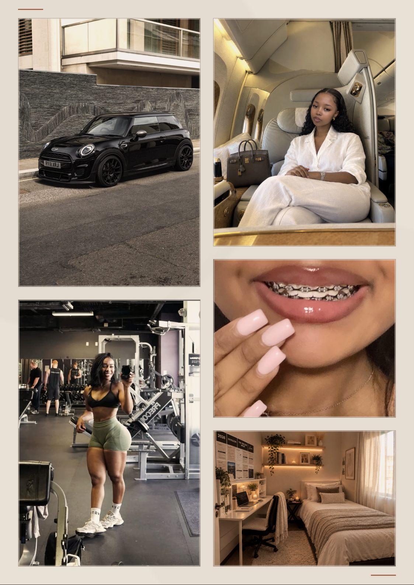

# 2026 Vision Wall

Pictures only. One **A3 portrait** sheet (297 × 420 mm), same paper and palette as
the vision board next door.



---

## What's here

| File | What it is |
|---|---|
| `print/vision-wall-A3-portrait.pdf` | The sheet, print-ready — 1 page, A3 portrait |
| `wall.html` | The same sheet on screen |
| `print.html` | The print stylesheet version, if you'd rather print from a browser |
| `preview/wall-A3.png` | The image above |
| `images/` | The five source pictures |
| `build.py` | Regenerates both HTML files |
| `render.mjs` | Re-renders the preview and the PDF, and reports every crop and print resolution |

## Printing

A3 portrait, **100% / "Actual size"**, background graphics **on**.

Ask for **matte or satin photo stock, 200 gsm+**. Plain paper will not hold the
blacks in the car shot. Matte also stops the sheet glaring under the shelf lights.

---

## How it's laid out

Two columns of 131 mm with a 9 mm gutter, 13 mm margins. Both columns come to
394 mm so the block sits flush top and bottom:

| | |
|---|---|
| **left** | car 131 × 193, gym 131 × 192 |
| **right** | travel 131 × 164, smile 131 × 114, room 131 × 98 |

Each frame was sized to stay close to its picture's own proportions, so most of
them are barely cropped at all. `render.mjs` prints how much each one loses and
what it will print at:

| Picture | Cropped | Prints at |
|---|---|---|
| car | 1% | ~143 dpi |
| gym | 15% (sides) | ~143 dpi |
| travel | 1% | ~220 dpi |
| smile | 21% (top/bottom) | ~143 dpi |
| room | 1% | ~282 dpi |

Two frames have a deliberate crop anchor rather than a centred one, set in
`build.py`:

- **gym** is pulled left (`22% center`) because the source is a phone screenshot
  with a "1/10" badge and a mute icon down its right edge — the crop loses them.
- **smile** is pulled down (`center 58%`) so the nails stay in frame along with
  the braces.

---

## On the grade

The five pictures come from five different cameras, and side by side they fight:
a near-black car, a green-grey gym, a warm candlelit bedroom, pink nails, a white
cabin. Every frame gets the same warm grade — a touch of sepia, slightly pulled
saturation, and a terracotta wash at 8% multiply — which is what makes them read
as one wall instead of a pinboard.

Turn it down or off with `WARMTH` at the top of `build.py`: `1.0` is what you see
above, `0` leaves the photographs exactly as they came.

**No text**, as asked. The only nod to the vision board is the pair of terracotta
ticks at top-left and bottom-right, and the paper itself. If you do want a title
band — `2026 · INVASION · THE SECOND WAVE · LOVE` across the top — set
`HEADER = True` and rebuild; it pulls the fonts from `../vision-board/fonts`.

---

## A note on resolution

Three of the five are social-media sized, so they land around **143 dpi** at the
printed size. That is under the 300 dpi a print shop will ask for, and up close
you will see it. On a wall at arm's length it holds up fine.

If any of them matters enough to be sharp, replace the file in `images/` with a
higher-resolution original and rebuild — nothing else needs to change, and
`render.mjs` will tell you the new dpi.

---

## Editing

```bash
python3 build.py                        # rewrites wall.html and print.html
npm i playwright && node render.mjs     # refreshes preview/ and print/
```

Swap a picture by dropping a new file into `images/` and changing the filename in
the `LEFT` or `RIGHT` list. Change a frame's size in the same place — but keep
each column's heights plus gutters summing to 394 mm, or the two columns stop
sitting flush.
